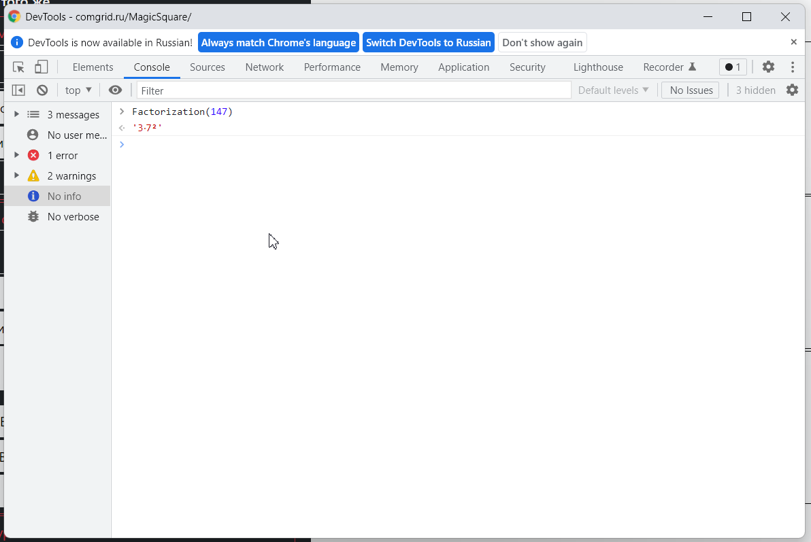

# Magic Squares
## Содержание
1. [Возможности интерфейса](#interface)
   1. [Блок "Главное меню"](#main-menu)
   2. [Блок "Сгенерировать dir-квадрат"](#generate-dir-square)
   3. [Блок "Решить tfmn-уравнение"](#resolve-tfmn-equation)
2. [Консоль](#console)
    1. [Полезные математические функции](#useful-math)
    2. Методы для генерации различных наборов данных
    3. Методы для работы с векторами
    4. Методы для fmn и tfmn-функций на векторах
    5. Методы для взлома RSA (история о том, как они сюда попали, 
   выходит за рамки этой документации)

---

## Возможности интерфейса <span id = "interface"></span>
Интерфейс к приложению был написан в первую очередь ещё летом 2021, и с тех пор не сильно изменялся. Основная его задача - предоставлять визуализацию магических квадратов. В частности, здесь в пару кликов можно сгенерировать `5/9-dir-квадраты` и `6/9-dir-квадраты` (см. теорию).

Здесь же предоставлена ссылка на [теоретический материал](https://comgrid.ru/MagicSquare/MagicSquare.pdf), на котором построено всё приложение (или большая его часть).

<p style="width: 100%; text-align: center">

<em>Кнопка-ссылка на теоретическое пособие</em>
</p>

Перед использованием сайта, и в том числе перед прочтением этой 
документации, рекомендуется ознакомиться с последней главой теоретического пособия.

Далее представлено краткое описание каждой кнопки интерфейса:

#### Блок "Главное меню" <span id = "main-menu"></span>
- `Задать`. На основе введённых значений *E, x, y* заполняет ячейки 
квадрата числами в классическом десятичном виде
- `Факторизовать`. То же, что и `задать`, но числа представляются 
своими факторизациями на простые множители
- `Минимизировать`. От термина "минимальный квадрат". Делит все элементы квадрата на их НОД
- `Повернуть влево`. Поворачивает текущий квадрат против часовой стрелки
- `Отразить`. Отражает текущий квадрат по вертикали
- `Повернуть вправо`. Поворачивает текущий квадрат по часовой стрелке
- `Умножить на`. Умножает каждый элемент квадрата на введённое значение

Здесь отметим, что сложность факторизации напрямую зависит от 
наибольшего простого делителя. Если у какого-то из элементов квадрата 
предположительно есть делитель больше, чем 10⁸, рекомендуется 
использовать для визуализации только кнопку "задать". Иначе возможно 
зависание приложения. В крайнем случае, проверьте в консоли, что все числа 
могут быть факторизованы

#### Блок "Сгенерировать dir-квадрат" <span id = "generate-dir-square"></span>
Этот блок напрямую связан с теорией.

- `Задать ACEGJ` - `Задать ACDFH` гарантированно сгенерируют 5/9 квадраты 
указанного вида, выставив в *E, x, y* подходящие значения, и нажав за вас 
кнопку `Задать` или `Факторизовать` (в зависимости от того, что вы 
использовали в последний раз)

- `Задать ACEFGH` и `Задать ABDFHJ` требуют определённых значений для 
`alpha1`, `beta1`, `alpha2`, `beta2`. Частичное решение необходимого условия 
может давать блок **"Решить tfmn-уравнение"**, за решениями, основанными на 
полном переборе, можно обратиться к методам консоли.

- Три кнопки `Обратить` меняют местами значения, введённые в инпуты, 
каждая на своём уровне. При этом автоматически новые значения появятся в квадрате. 
Для отдельных видов 5/9-квадратов это преобразование меняет местами противоположные 
элементы одной dir-линии, либо меняет местами две dir-линии, при этом значения в 
остальных клетках меняются относительно непредсказуемо.

  Хороший пример этого -- знаменитый ABEHJ-квадрат (единственный известный 7/9), 
получаемый на значениях 9 2 3 4. В зависимости от порядка пар и чисел в парах, 
он может представлять собой 7/9, 6/9 и 5/9 квадрат.

<p style="width: 100%; text-align: center">
 <br>
<em>Знаменитый 7/9</em>
</p>

- `Зарандомить` устанавливает в каждый инпут рандомное значение не больше `maxRandom`, но вы никогда не получите пару не взаимно простых `alpha` и `beta`.

#### Блок "Решить tfmn-уравнение" <span id = "resolve-tfmn-equation"></span>
Этот блок призван генерировать 6/9 квадраты

Все решения -- параметрические, и принимают на вход два параметра. 
Подробнее -- в теории. Приложение лишь реализует эти решения

`Зарандомить` и `Обратить` работают так же, как и в блоке выше

---
## Консоль <span id = "interface"></span>
Несмотря на то, что изначально система создавалась для визуализации определённых видов квадратов, 
и в этой роли она действительно оказалась полезной, в последующем
при исследовании я столкнулся с необходимостью решать кодом несколько
более сложные задачи, визуализация которых, при этом, не так важна

Для этого я не стал далеко ходить, и просто написал весь необходимый
код в том же проекте. JavaScript-код исполняется прямо в браузерной
консоли, все написанные методы к странице доступны для вызова. Мудрые
и другие люди скажут, что Python - тоже исполняемый язык, есть возможность 
также легко использовать методы для него. Однако так сложилось, что
весь код по текущей задаче, по крайней мере, от меня, написан на js.

Как его использовать? Для этого на странице приложения используйте комбинацию клавиш 
ctrl+shift+I (для браузера Google Chrome), либо кликните правой 
кнопкой мыши и выберите "инструменты разработчика". В открывшемся
меню выберите вкладку Console. Для примера, введите Factorization(147)

<p style="width: 100%; text-align: center">

<em>Браузерная консоль</em>
</p>

Надеюсь, однако, что человек, читающий это пособие, имеет базовые 
знания в программировании, а также способен самостоятельно решить
все возникающие технические трудности. Далее в этой документации
будет представлено лишь описание функций, реализованных для использования

Встроенные функции js также не будут здесь рассмотрены

#### Полезные математические функции <span id = "useful-math"></span>
- ```typescript
  Math.gcd(...args: number[] | BigInt[]): number | BigInt
Принимает любое количество параметров типа `number` или `BigInt`, 
возвращает их наибольший общий делитель.

НОД считается алгоритмом Евклида. В зависимости от типа данных,
сложность выражается либо _**O(log(n))**_, либо _**O(log²(n))**_ для 
двух параметров, где n - больший из них. Если параметров больше,
функция последовательно вызывает саму себя для текущего значения
НОД и следующего параметра. То есть по правилу, 
`gcd(a, b, c, d) = gcd(gcd(gcd(a, b), c), d)`

- ```typescript
  Factorization(n: number | BigInt): string
Принимает число, возвращает его факторизацию в виде строки.

Сложность алгоритма для `number` - _**O(sqrt(p))**_ или _**O(p)**_, где _p_ - 
наибольший простой делитель _n_.

- ```typescript
  FindMinFactor(n: number | BigInt | string, lastFactor: number | BigInt | string): BigInt
Возвращает наименьший множитель числа _n_, больше, чем _lastFactor_. Приводит все входящие
значения к BigInt.

Сложность алгоритма - **_O((p - lastFactor)log(n))_** для не простых _n_, 
**_O(sqrt(n)log(n))_** -- для простых. _p_ -- наименьший простой делитель n

- ```typescript
  FindMinFactorNotBigInt(n: number, lastFactor: number): number
Метод такой же, как `FindMinFactor`, но работающий только с типом `number`

Сложность алгоритма - **_O((p - lastFactor))_** для не простых _n_,
**_O(sqrt(n))_** -- для простых. _p_ -- наименьший простой делитель n

- ```typescript
  FindMeanForTfmnMinFactor(n: number | BigInt | string, lastFactor: number | BigInt | string): BigInt
Работает так же, как и `FindMinFactor`, но если не находит делителя _n_ меньше, чем _n^1/4_,
возвращает _n_.

Сложность алгоритма - **_O((p - lastFactor))_** если p найдено,
**_O(n^1/4)_** -- если нет. _p_ -- наименьший простой делитель n

Примечание: несмотря на название, метод не может быть использован для расчёта tfmn-функции.
Существуют ситуации, когда n делится на квадрат, натурального и не имеет при этом простых
множителей меньше, чем _n^1/4_.

- ```typescript
  reduce(n: number | BigInt | string, k: number | BigInt | string): BigInt
Делит _n_ на _k_ до тех пор, пока _n_ делится на _k_. Приводит 
все входные параметры к `BigInt`.

- ```typescript
  GetPowerIn(n: number | BigInt | string, k: number | BigInt | string): BigInt
Находит, сколько раз можно поделить _n_ на _k_. Приводит всё к `BigInt`.
